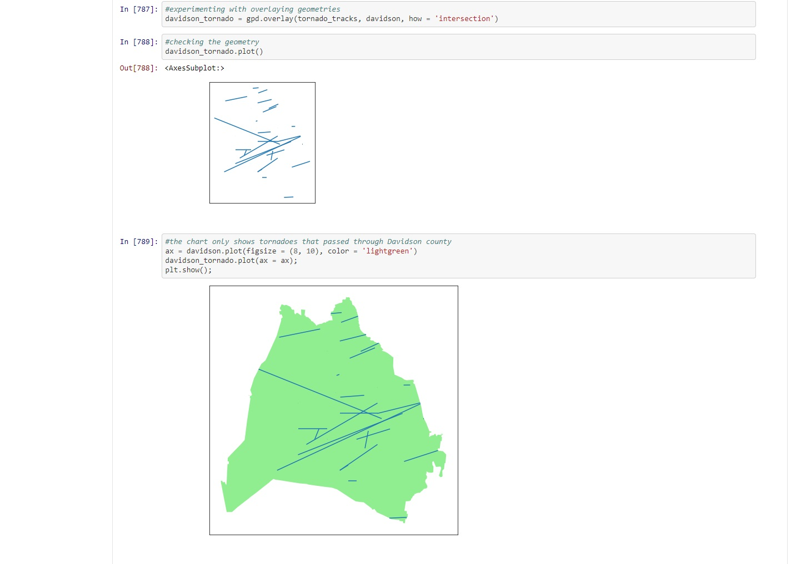
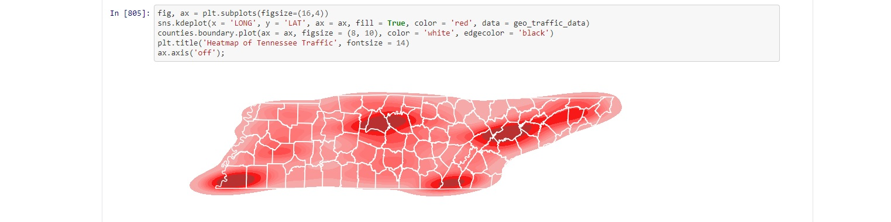
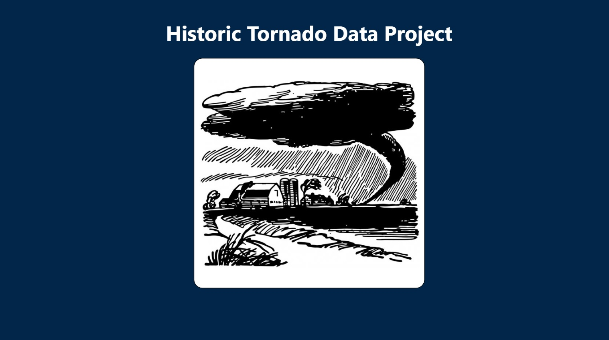
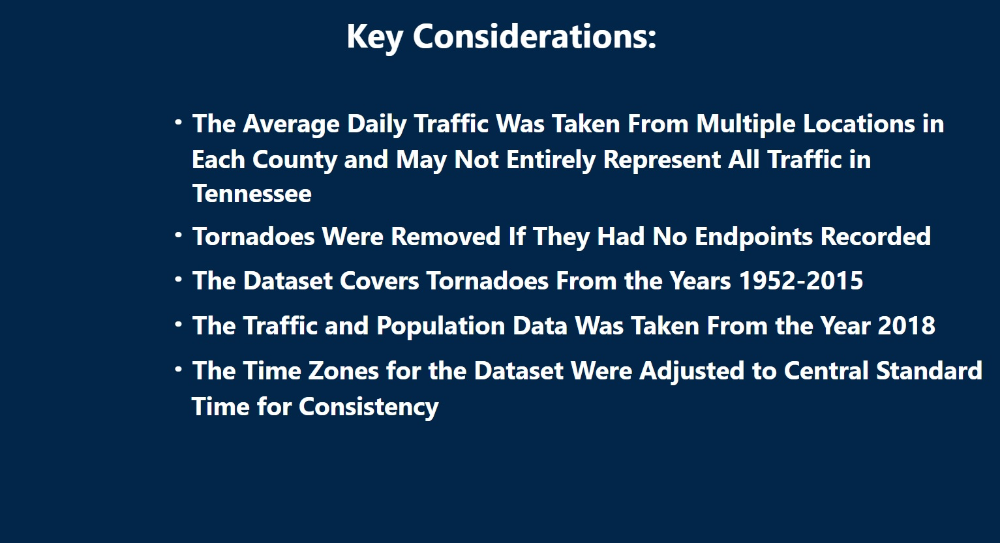
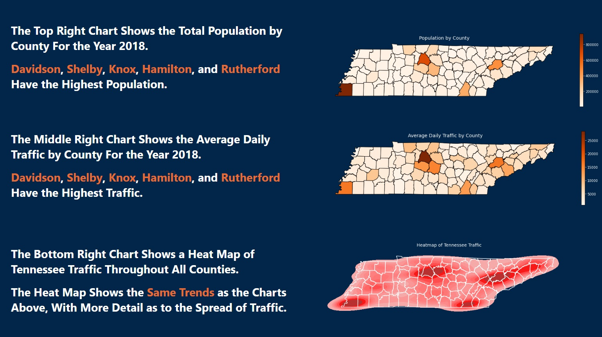
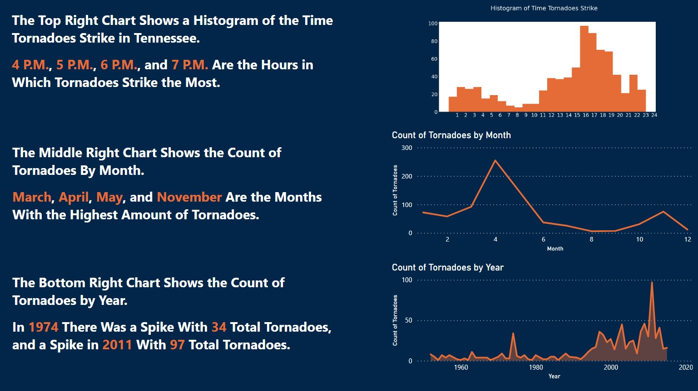
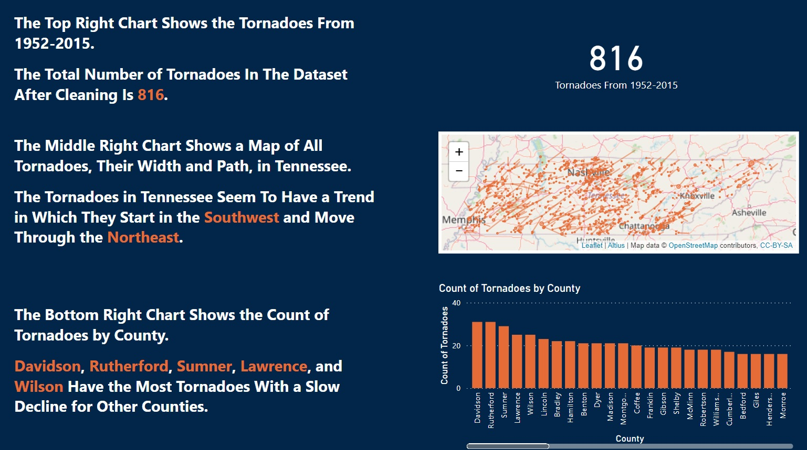
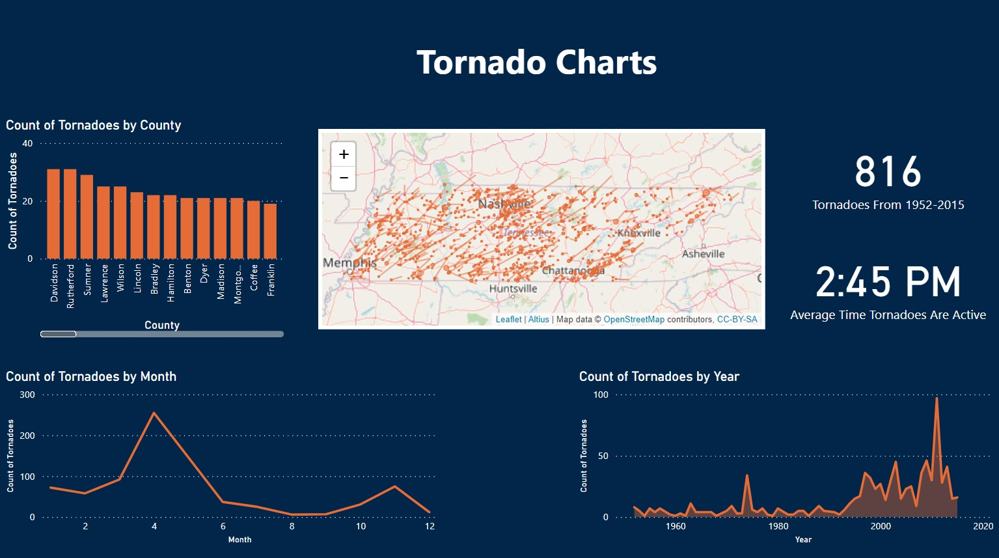
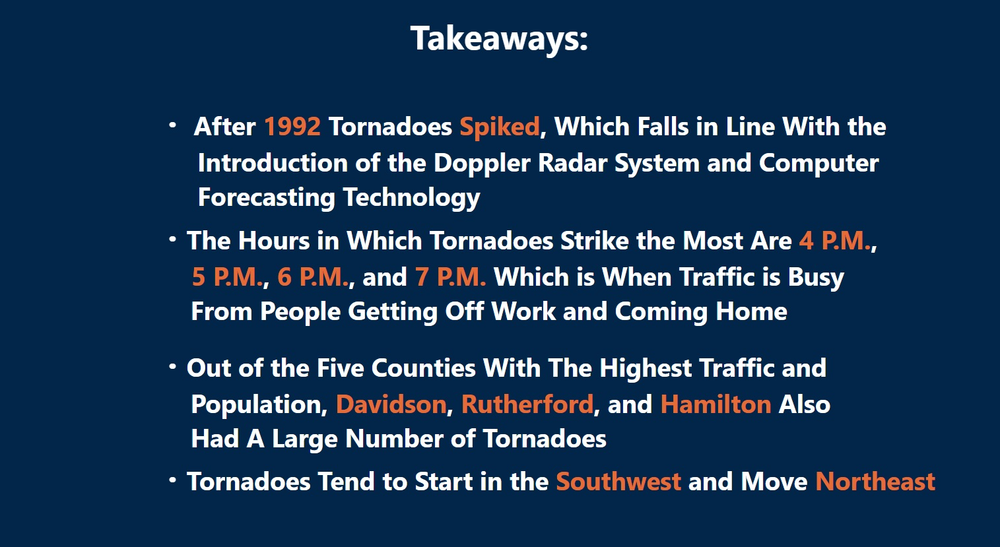

# historic-tornado-data-project

# Introduction
In this project, I was given the task of comparing Tennessee tornado tracks with traffic and population data. When going through the dataset I wanted to see if there were any trends in population density, traffic density, and where tornadoes typically strike. For this project, I used Python in a geospatial environment for data analysis and PowerBI for dashboarding.

Data Sources:  [Tennessee Tornado Tracks Data](https://hifld-geoplatform.opendata.arcgis.com/datasets/historical-tornado-tracks?geometry=-89.018%2C35.804%2C-) 
              [Tennessee Traffic Data](https://www.arcgis.com/apps/webappviewer/index.html?id=075987cdae37474b88fa400d65681354) 
              [Tennessee Population Data](https://www.census.gov/data/tables/time-series/demo/popest/2010s-counties-total.html#par_textimage)

# Proposal
[Proposal Document](assets/Brandon_Morgan_Capstone_Proposal.pdf)

# Table of Contents
* [Introduction](#Introduction)
* [Proposal](#Proposal)
* [Python Walkthrough](#Python-Walkthrough)
* [Presentation Walkthrough](#Presentation-Walkthrough)

# Python Walkthrough
1. For the beginning of the project I import all packages I intend to use

2. Afterwards I read in the four files I will need for the project using `gpd.read_file` and `pd.read_csv`

3. I started cleaning some of the data earlier in the notebook as I noticed some inconsistencies further down in the notebook.

4. During this part of the project I checked to see what data types of columns were included in the datasets along with making sure my changes in the past step executed properly

5. For the dataframes I noticed inconsistency with how the counties in Tennessee were listed, so I created a list to convert into a column for the sake of consistency

6. Throughout this step I cleaned the population data by adding the county list as a column and dropping unnecessary columns from the dataframe

7. For this step, I needed to subset the traffic data, as it included unnecessary years for the project

8. I needed to clean the 2018 traffic data further after subsetting as there were lingering columns not needed, along with renaming the `X` and `Y` columns to `LAT` and `LONG` for creating a geodataframe later

9. Afterwards I created a geodataframe from the traffic data `LAT` and `LONG` columns

10. Now I combine the traffic, county, and population dataframes to get the population, average daily traffic, and county information

11. The primary dataset, the tornado dataframe starts to get cleaned in this step, and we start with dropping unnecessary columns, changing datatypes and adding columns for plotting, and removing lat and lon rows that have values of zero

12. During this step I experimented with plotting to see how the data looked, seeing that there was still some cleaning work to do

13. At this step I found out that you can use `gdp.overlay` to intersect the geopoints, so that the tornado geometry are broken up by county

14. Now I take the information I learned from the step above to create a geodataframe that has the tornado geometry broken up by county

15. There was some slight cleaning to do for the `county_tornado` dataframe

16. I created a dataframe specifically for plotting in folium to preserve the integrity of the original `county_tornado` dataframe

17. The next step is where I answered questions I wanted to answer when gathering the data

18. At this point in the project I create charts to use in the presentation using the cleaned `county_tornado` and `geo_traffic_data` dataframes

19. I created a folium map to show the tornado paths throughout each county, sadly it does not show up on github

20. Then I created a histogram to see what hours had the most tornadoes across the dataset

21. Finally, I exported the dataframe created from the project that I will need for dashboarding
# Presentation Walkthrough
1. The first slide is an intro with the name of the presentation

2. The second slide goes over the key considerations for the project

3. The third slide covers the population and traffic history for the state of Tennessee

4. The fourth slide goes over the time of day that tornadoes typically strike along with the months and years with the most tornadoes

5. The fifth slide shows the count of tornadoes for Tennessee from 1952-2015 along with a map showing the tornado tracks and a bar chart showing what counties had the most tornadoes overall

6. The sixth slide has an interactive dashboard with some of the previous charts used along with an average time of day that tornadoes are active

7. the seventh and final slide has a list of key takeaways from the presentation

